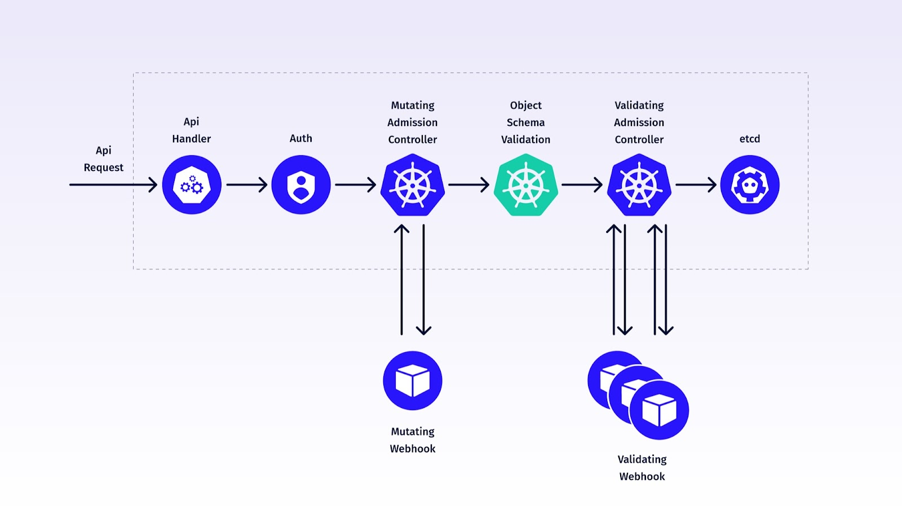

# Pod Labeler Mutating Webhook

## Overview

This project implements a Kubernetes MutatingAdmissionWebhook, serving as an [admission controller](https://kubernetes.io/docs/reference/access-authn-authz/admission-controllers/) in the Kubernetes cluster. 
The webhook intercepts Deployment creation and update requests and automatically adds a priorityClassName (eg: ```priorityClassName=high-priority-nonpreempting```).

Additionally, the webhook code can be easily modified to perform various other changes to other K8s objects, such as altering their names, adding security parameters or injecting a sidecar.

## Admission Controllers and webhooks in the K8s Architecture



## Prerequisites

Before getting started with the webhook, ensure that the following tools and resources are available:

- **Docker**: The webhook runs as a container, so Docker is necessary.
- **Kubernetes Cluster**: You'll need a running Kubernetes cluster where the webhook will be deployed.
   - Use my [terraform code](https://github.com/andreistefanciprian/terraform-kubernetes-gke-cluster) to build a Private GKE Cluster for this purpose. Or use Kind or Docker-Desktop to build a local cluster
- **cert-manager**: Required for generating TLS certificates for the webhook and injecting caBundle in webhook configuration.
   - You can install cert-manager with [helm](https://artifacthub.io/packages/helm/cert-manager/cert-manager) or use my [flux config](https://github.com/andreistefanciprian/flux-demo/tree/main/infra/cert-manager).
- **Go**: The webhook is written in Go.
- **jq**: Used for parsing and manipulating JSON data in the Makefile.
- **Makefile**: The project uses a Makefile for automation and building. Understanding Makefile syntax will help you work with the provided build and deployment scripts.
- **Kustomize**: Used for bulding the test scenario manifests.

In case you are using your own credentials for the container registry, make sure you set up these credentials as Github Secrets for your repo.
These credentials are used by Github Actions to push the image to dockerhub.

   ```
   # Set Github Actions secrets
   TOKEN=<dockerhub_auth_token>
   gh secret set DOCKERHUB_USERNAME -b"your_username"
   gh secret set DOCKERHUB_TOKEN -b"${TOKEN}"
   ```

## Build and Run the Webhook

Build, Register, Deploy and Test the webhook using the provided tasks:

1. Build and push the Docker image to the container registry:
   ```
   make build
   ```

2. Deploy and Register webhook:
   ```
   make install
   ```

3. Test webhook:
   ```
   # check logs while creating test Pods and Deployments
   kubectl logs -l app.kubernetes.io/name=priorityclass-webhook --namespace priorityclass-webhook -f

   # create Pods and Deployments
   make test

   # cleanup test pods
   make test-clean
   ```

5. Unregister and Remove the webhook:
   ```
   make uninstall
   ```

Feel free to adjust the tasks and configurations as needed to fit your specific environment.

## License

This project is licensed under the [MIT License](LICENSE). Feel free to use and modify it according to your requirements.